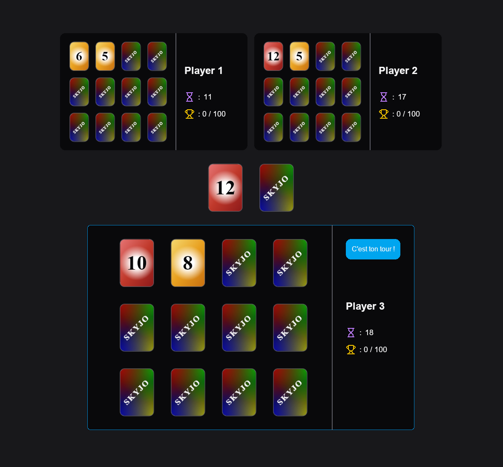

# 🎮 Skyjo


## 📖 Overview

Skyjo is a multiplayer desktop card game inspired by the popular Skyjo board game.

The project combines a React and TypeScript frontend with a custom C# multiplayer backend responsible for
game logic, networking, and state synchronization between connected players.

Players can host or join a game session, play multiple rounds, and track cumulative scores until a player
reaches the score limit.

This project was developed collaboratively, with a strong focus on multiplayer gameplay, responsive user 
interactions, and real-time state synchronization.

---

## 🧰 Tech Stack

### Frontend

* React 19
* TypeScript
* Vite
* Zustand
* Tailwind CSS
* DnD Kit
* React Router

### Backend

* C#
* Custom multiplayer networking
* Game state replication
* Turn-based game logic

---

## 🚀 Features

* Multiplayer card game experience
* Host and join game sessions
* Turn-based gameplay
* Real-time game state synchronization
* Drag-and-drop card interactions
* Round score tracking
* Global score tracking across multiple rounds
* Visual turn indicators
* Native desktop game client

---

## 🏗️ Frontend Architecture

```text
src/
├── components/
│   ├── gameView/
│   │   ├── opponent/
│   │   ├── player/
│   │   └── shared/
│   └── ui/
├── hooks/
├── interfaces/
├── pages/
├── store/
└── styles/
```

### Architecture Overview

* components/ – Game and UI components
* hooks/ – Custom React hooks
* interfaces/ – Application data models and TypeScript types
* pages/ – Application views
* store/ – Zustand state management
* styles/ – Styling and visual customization

The frontend is organized around reusable React components and centralized state management to keep gameplay 
updates predictable and maintainable.

---

## 🔄 Multiplayer Architecture

The application follows a client-server architecture.

* A host creates and manages the game session.
* Players connect to the host through a network configuration.
* The backend validates gameplay actions and synchronizes state across connected clients.
* Clients receive game updates and refresh the interface accordingly.
* Scores are maintained across rounds until the game-ending threshold is reached.

This architecture allows multiple players to participate in the same match while sharing a synchronized 
game state.

---

## 🎨 My Contributions

My primary responsibility on this project was the frontend application.

Key contributions include:

* Frontend architecture design
* UI/UX design and gameplay interaction design
* React implementation
* TypeScript development
* Zustand state management
* Drag-and-drop gameplay interactions
* Player and score visualization
* Multiplayer state rendering
* Gameplay feedback systems

The complete UI/UX experience was designed and implemented by me, including gameplay interactions, player feedback, 
and game state visualization. The implementation was refined through regular collaborative code reviews and technical 
discussions.

---

## 🤝 Collaboration

This project was developed collaboratively.

I was responsible for the frontend implementation and user experience, while the multiplayer backend, networking 
layer, and core game logic were developed by an experienced backend-focused collaborator.

Development included regular code reviews, technical discussions, and iterative improvements across both 
frontend and backend systems.

---

## 📸 Screenshots

### Gameplay



---

## 📊  Project Status

The project is considered feature-complete and is actively used for private multiplayer sessions.

Development is currently paused, with no major features planned.

---

## 📝 Notes

This project was built to explore multiplayer game development, frontend architecture, and real-time state 
synchronization in a collaborative environment.

The project emphasizes:

* React and TypeScript development
* State management with Zustand
* Multiplayer game UX/UI design
* Real-time gameplay interactions
* Collaborative software development
* Maintainable frontend architecture
